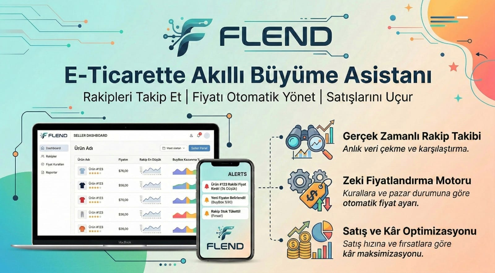

# Flend

Roseware

---

## Proje Hakkında

**Proje Tanımı:** 
Flend; e-ticaret pazaryerlerinde (Trendyol, Hepsiburada, Amazon vb.) satış yapan firmalar için otomatik bir rekabet ve kâr optimizasyonu asistanıdır. Satıcıların kendi ürünlerinin linkini ve rakip linklerini girmesiyle sistem arka planda 7/24 güncel fiyat, stok durumu ve mağaza puanı çeken B2B SaaS yapısıdır. Kullanıcının belirlediği kurallara göre (Örn: "Rakip benden ucuzsa fiyatımı ondan 1 TL aşağı çek ama maliyet altına inme") pazaryerine API üzerinden yeni optimum fiyat gönderir ve fırsat bulduğunda kâr marjını artırmak için fiyatı yükseltir.

**Proje Kategorisi:** 
E-Ticaret / B2B SaaS

---

## Proje Linkleri

- **REST API Adresi:** [api.flend.com](https://api.flend.com)
- **Web Frontend Adresi:** [frontend.flend.com](https://frontend.flend.com)

---

## Proje Ekibi

**Grup Adı:** 
Roseware

**Ekip Üyeleri:** 
- Tufan Akbaş
- Mehmet Taşcı
- Muhammed Hamza Çakmak
- Kadir Cihan Kığılcım
- Nurullah Turgut

---

## Dokümantasyon

Proje dokümantasyonuna aşağıdaki linklerden erişebilirsiniz:

1. [Gereksinim Analizi](Gereksinim-Analizi.md)
2. [REST API Tasarımı](API-Tasarimi.md)
3. [REST API](Rest-API.md)
4. [Web Front-End](WebFrontEnd.md)
5. [Mobil Front-End](MobilFrontEnd.md)
6. [Mobil Backend](MobilBackEnd.md)
7. [Video Sunum](Sunum.md)
